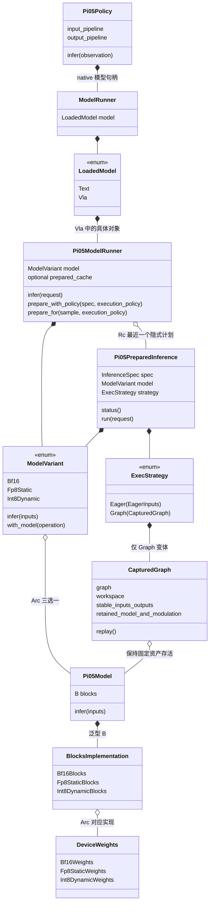
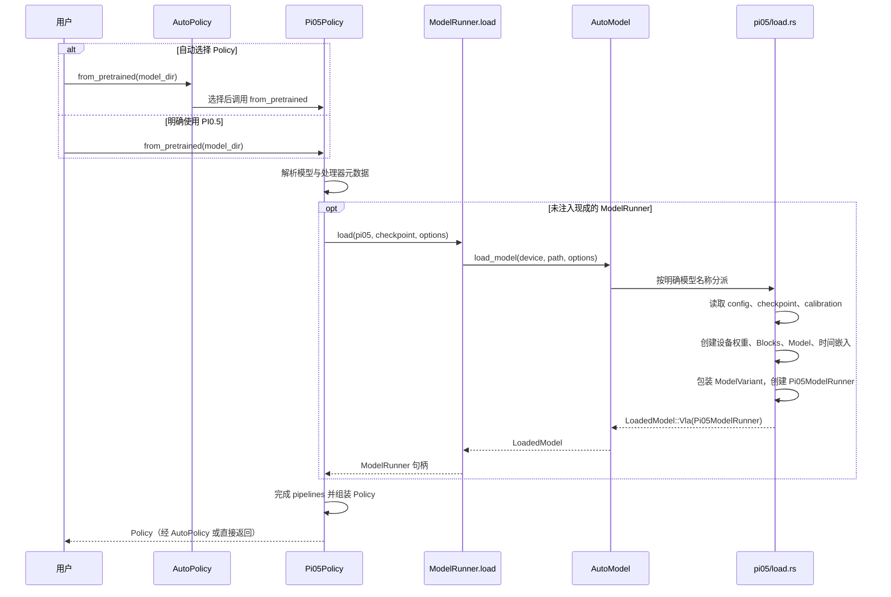
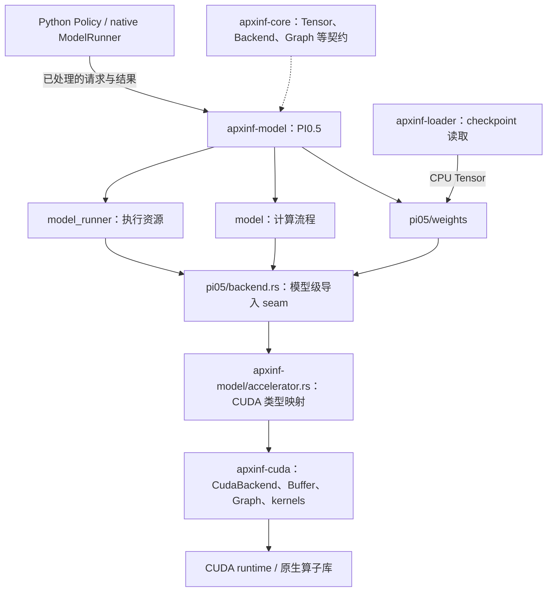
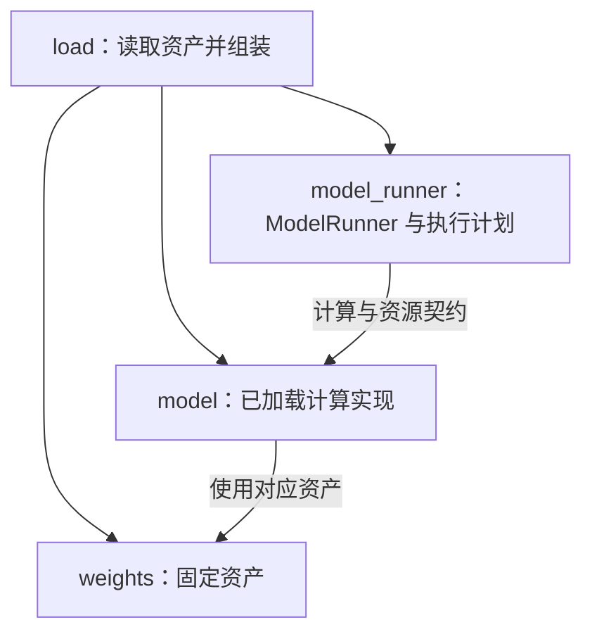
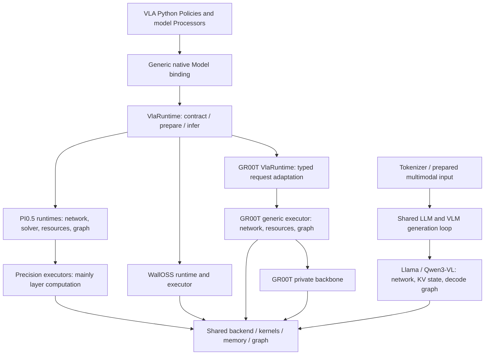
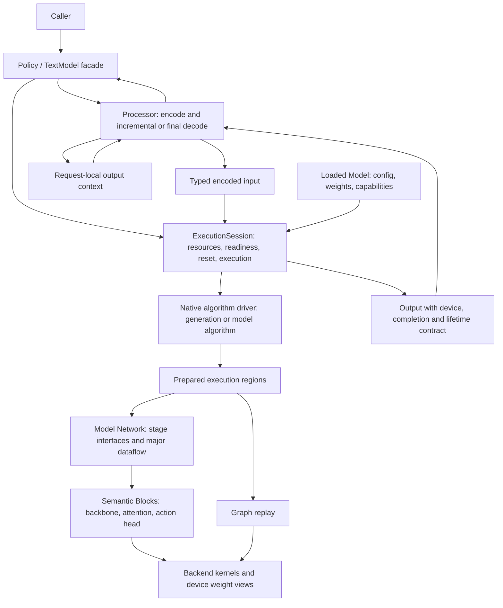

# PI0.5 model architecture and module contracts

Status: PI0.5's implemented model/model_runner/weights organization on this
branch. Start with the current component view below. For cross-family naming,
module placement and current option limits, use
[Model Layer Architecture](../model-layer-architecture.md#current-module-names-and-responsibilities).
For new integration steps, use [Adding a New Model](../adding-a-new-model.md).

[Lifecycle contracts](lifecycle.md#implemented-pi05-preparation-contract) define
the implemented preparation API. The [migration tracker](migration.md) and
[baseline record](baseline.md) preserve revision-qualified GPU evidence.
WallOSS, GR00T and LLM/VLM have not inherited PI0.5's internal organization or
preparation guarantees merely by sharing a trait.

## Implemented PI0.5 pilot (Stage 2)

PI0.5 now uses model/model_runner/weights modules; the former precision runtime
files and compatibility types have been removed. This section describes PI0.5,
not unmigrated families. Source-qualified CPU/CUDA and performance results are
tracked in [migration.md](migration.md), with historical evidence in [baseline.md](baseline.md).

### Canonical names and Python/Rust relationship

The current names distinguish the model's forward computation from the runner
that prepares and executes it. This naming migration preserves the existing
objects, resource ownership and call order; it introduces no additional wrapper.

| Previous name | Current name | Responsibility |
| --- | --- | --- |
| `apxinf.Model` / `apxinf_py.Model` / PyO3 `Model` | `ModelRunner` | One native Python type, re-exported by `apxinf`; input/output conversion and calls into Rust |
| `Pi05Session` / `execution/` | `Pi05ModelRunner` / `model_runner/` | PI0.5 preparation, execution resources, implicit cache and inference |
| `Pi05Network<B>` / `network/` | `Pi05Model<B>` / `model/` | Shared model forward computation |
| `LoadedCompute` / `network/compute.rs` | `ModelVariant` / `model/model.rs` | Runtime choice of a loaded precision-specific model and fixed time embeddings |
| `BareModel` | `ModelRunnerProtocol` | Python policy's structural runner contract |
| `policy.model`, injected `model=` | `policy.model_runner`, injected `model_runner=` | Policy's reference to the native runner |
| `Styles` / `*StepStyles` | `StepModulation` / `*StepModulation` | Per-timestep scale/shift/gate tensors for adaptive RMSNorm and gated residuals |

`AutoPolicy` selects a Python policy; there is no Python `AutoModel` class.
The binding's `ModelRunner.load` calls the separate Rust `AutoModel::load_model`
factory. That factory selects a registered model loader and returns the existing
`LoadedModel::{Text, Vla}` enum. For PI0.5, its VLA value contains a
`Pi05ModelRunner` through `Box<dyn VlaRuntime>`. `LoadedModel` is a
heterogeneous loading result, not another execution layer or a Worker.

Python provides `Pi05Policy`, not a Python `Pi05Model` network implementation.
The policy chooses model-specific preprocessing and action decoding; Rust chooses
the network and precision implementation. The binding `ModelRunner` and concrete
`Pi05ModelRunner` are distinct owning objects, not duplicate copies of weights.
`AutoPolicy` and `AutoModel` are construction entry points and are absent from
the per-inference call chain.

`StepModulation` is derived from fixed weights and a timestep's conditioning
vector. Each action layer has attention and MLP modulation, plus the final norm
modulation. It is computed data, distinct from the learned projection weights;
it can be precomputed because it does not depend on the observation or noise.
OpenPI calls the projected vector `modulation`, split into `scale`, `shift` and
`gate`; PI0.5 uses adaptive RMSNorm rather than LayerNorm.

The native binding must be rebuilt together with the Python package for these
public renames. Model-family load arguments such as `model="pi05"`, checkpoint
keys, calibration formats and `model_variant` values retain their meaning.

### CPU helpers in `pi05/math.rs`

[`math.rs`](../../crates/apxinf-model/src/pi05/math.rs) is directly under `pi05/`,
alongside `model/`, `model_runner/` and `weights/`. It is compiled without the
`cuda` feature and its four functions are re-exported by `pi05/mod.rs`:

| Function | Purpose and current caller |
| --- | --- |
| `sinusoidal_time_embedding` | Generates the fixed flow timestep embeddings used by `model/model.rs` during loading; uses float64 intermediate arithmetic to match OpenPI |
| `discretize_state` | CPU utility matching NumPy state binning, including boundary behavior; exercised by CPU tests |
| `pi05_prompt` | CPU reference for task normalization and optional state-to-prompt formatting; calls `discretize_state` |
| `euler_flow_step` | CPU reference for `x -= velocity / num_steps`; tests the reverse-time sign |

The current Python input pipeline uses `processors/tokenize.py`, not bindings to
the Rust state/prompt utilities. Production GPU action updates live in the Block
implementations and kernels, not this CPU Euler helper. This file is neither an
execution layer nor a second model implementation. Its five unit tests can run
with `cargo test -p apxinf-model --no-default-features pi05::math::tests --lib`.

### 对象关系：谁持有谁

本图只表达持有关系，不表达加载顺序或调用顺序。`*--` 实心菱形表示
拥有成员；`o--` 空心菱形表示共享持有，具体以 Rust 的 `Arc` / `Rc` 为准。
菱形位于持有者一端。`..>` 表示调用依赖，留给时序图表达，不混入本图。



`Pi05Policy` 在 Python 层，`ModelRunner` 是 native binding 对象，其余是 Rust 类型。
`BlocksImplementation` 和 `DeviceWeights` 仅为图中的分组，不是实际基类；
三种 Blocks 分别实现 `Blocks` 与 `PrepareBlocks` trait。`Pi05Model<B>`
共享一份源码，由 Rust 静态特化。`ModelVariant` 是带数据的 enum，其方法集中
转发到对应 Model，不重复实现模型数学计算，也不管理计划缓存。

- **Policy = ModelRunner + 输入/输出 pipelines**。ModelRunner 不包含 tokenizer 或动作反归一化。
- **绑定 ModelRunner 间接持有 Pi05ModelRunner**，是包含执行状态的用户侧句柄。`LoadedModel::Vla`
  是统一容器的一个变体，不是另一个名叫 LoadedVla 的执行对象。
- **ModelVariant 是 PI0.5 内部的已加载计算实现**，含 Model 和时间嵌入。
  `LoadedModel` 区分 Text/VLA 接口；`ModelVariant` 区分 PI0.5 的计算实现。
- **Pi05ModelRunner 和计划没有互相持有**。计划不引用 Pi05ModelRunner；两者共享 Pi05Model。
  清除隐式缓存或释放 ModelRunner，不会销毁调用方仍持有的显式计划。
- **CapturedGraph 拥有 graph 和工作区，并保留 Model 引用**。CUDA Graph 使用
  设备地址，不会自动替 Rust 持有权重；这条引用链防止 graph 活着而权重先释放。
  共享引用不复制权重。graph 先于其引用的内存释放。

### 加载调用链：谁创建这些对象

AutoPolicy 选择 Policy 类；AutoModel 是统一 native 加载入口，也接受明确的
模型名称。它们不是必须成对使用的对象。直接调用 Pi05Policy 只跳过 AutoPolicy；
当前没有独立的 Python Pi05Model 类。模型家族和精度实现在加载时选定；
推理时仍通过 LoadedModel/VlaRuntime 和 ModelVariant 转发到已选定的实现。



`ModelRunner.load()` 返回 ModelRunner，不返回 ModelVariant。普通 Python 调用为
`policy = Pi05Policy.from_pretrained(path, model_variant="bf16")`，随后
`policy.infer(observation)`。它执行 input_pipeline → 绑定 ModelRunner.infer_rgb →
LoadedModel.infer_host_f32 → Pi05ModelRunner.infer_host_f32 →
Pi05ModelRunner.infer → output_pipeline。处理后的 observation 还会传给输出 pipeline，
供状态相关的机器人适配使用。encode/decode 是概念描述，不是同名 Rust 接口。

### 权重结构与归属

`weights/host.rs` 的 `Pi05Weights` 是共同的 PI0.5 checkpoint 逻辑树：vision、
language_layers、action_layers、norm、action_in/out 和 time_mlp_in/out。
加载时转换为三种并列的设备结构，由对应 Blocks 持有，Model 不访问具体布局。

| 文件 | 内容 |
| --- | --- |
| host.rs | checkpoint 映射和 PI0.5 逻辑权重树；不是跨模型统一权重树 |
| packing.rs | 共用矩阵拼接工具，不依附 FP8 实现 |
| bf16.rs | Bf16Weights；linear 存储含 BF16 Tensor、bias 和可选特殊布局 |
| fp8_static.rs | Fp8StaticWeights；linear 存储含 E4M3 Tensor、weight scale 和布局 |
| int8_dynamic.rs | Int8DynamicWeights；INT8 buffer、每输出通道 weight scales、bias |
| fp8_static_calibration.rs | FP8 表示、校准 profile 和固定激活 scales |

静态 FP8 的激活 scales 来自校准；动态 INT8 的激活 scales 在运行时按行生成，
权重 scales 仍固定。每种设备文件内部包含 linear 子模块和模型聚合结构，
没有另建三套 Model，也没有把通用打包操作放在某个 dtype 的文件下。

```text
pi05/
  mod.rs                       public exports and registration
  config.rs                    fixed model configuration and model_variant
  load.rs                      checkpoint loading and module assembly
  backend.rs                   model-wide accelerator seam
  math.rs                      CPU-capable model math helpers

  model_runner/
    mod.rs                     ModelRunner / plan / low-level capture exports
    runner.rs                  private state, input binding, cache and validity
    prepare.rs                 allocation, warmup, capture and graph ownership

  model/
    mod.rs                     model dataflow and computation/resource interface
    model.rs                 construction, ModelVariant and static dispatch
    calibration.rs             private BF16 observer and diagnostic traversal
    blocks/
      mod.rs                   semantic Blocks contract
      bf16.rs                  BF16 backbone and layers
      fp8_static.rs            static FP8 backbone and layers
      int8_dynamic.rs          dynamic-activation INT8 backbone and layers

  weights/
    mod.rs                     fixed-asset exports
    host.rs                    PI0.5 checkpoint mapping and logical weight tree
    packing.rs                 shared model-local host matrix packing
    bf16.rs                    BF16 linear storage and device model tree
    fp8_static.rs              static FP8 linear storage and device model tree
    int8_dynamic.rs            INT8 linear storage and device model tree
    fp8_static_calibration.rs  calibration profile and fixed scales

```

The tree has 22 Rust files (20 before this module encapsulation); the model
root has five files. The extra files are model_runner/mod.rs and model/model.rs,
which provide module ownership and loaded-computation dispatch rather than new
per-layer abstractions. Each device-weight file groups its linear storage in
an internal module and its aggregate model tree in the same file. Backbone/layer
code also remains grouped per variant instead of expanding into many one-function
files. Cross-model matrix/view reuse remains a later evidence-driven extraction;
PI0.5's own weight organization is complete in this stage.

Model owns the full model order and flow step count/dt. Blocks own backbone
layer loops, fusion, physical layout and fixed weights. The model dataflow methods depend on the Blocks contract; the model module
exports and ModelVariant dispatch select concrete implementations. BF16-only calibration
traversal lives privately in model/calibration.rs.
Rust statically specializes the Model for each implementation. `model/model.rs` wraps
these types for the public ModelRunner; no per-layer virtual calls are introduced.

Blocks report workspace requirements and perform their native input conversion.
ModelRunner allocates request/noise buffers; `model_runner/prepare.rs` allocates graph workspace
and capture-specific resources, prepares fixed modulation, warms up until tactics
stabilize, captures with the shared CUDA scope, and returns a single CapturedGraph
for every variant. Its erased fixed-resource owner retains the concrete Model
and modulation tensors; this erases ownership storage only, not computation dispatch.
The executable graph is dropped before the memory it references.

ModelRunner owns the preparation policy, request validation, RNG rebinding, tactic
invalidation and implicit cache. It does not choose FP8/INT8 implementations or
manage separate precision graph types. There is no replacement runtime facade.
Low-level diagnostic callers construct a Model with `build_*_model`, call
its computation methods, and explicitly use `capture_patches` or `capture_rgb`.
Ordinary callers use AutoModel and prepare/run.

### 与周边 crate 的 Interface / seam

PI0.5 位于 `apxinf-model` crate；model_runner、model、weights 是它内部的三个 Rust
module，不是三个 crate。模型层定义模型语义与执行生命周期，CUDA crate 提供设备
资源和算子。当前实际连接的是 **apxinf-cuda**，不是 apxinf-cuda-new。



| 对接方 | Interface 与职责 |
| --- | --- |
| Python Policy / apxinf-py | processors 留在 Policy；native ModelRunner 持有 LoadedModel::Vla，向 Pi05ModelRunner 传模型请求，接收动作输出 |
| apxinf-core | 提供 Tensor、Device、Backend、Graph、RNG 等基础类型和契约；加载入口使用 Arc&lt;dyn Backend&gt; |
| apxinf-loader | 读取 SafeTensors 等资产；PI0.5 weights 解释 checkpoint 键名、形状和模型专属转换 |
| apxinf-cuda | 实现 CUDA buffer/传输、graph scope、workspace、tactics 和算子；不决定 PI0.5 的 vision/prefix/flow 顺序 |

加载器通过 `accelerator::create_backend` 获取统一 Backend；PI0.5 loader 检查并
将其转换为具体 CUDA backend。`RuntimeBackend` 当前是 `CudaBackend` 的类型别名，
`DeviceBuffer` 对应 `CudaBuffer`。Blocks 通过 `kernels` 直接调用 CUDA 专属算子，
不要求把融合算子都塞进通用 Backend trait，也不增加逐层动态派发。

具体使用分工：weights 转换/打包并上传固定资产；model/Blocks 调用计算算子；
model_runner 管理输入、RNG、workspace、预热、capture 和 replay。底层分配、传输及
capture 清理由 CUDA crate 实现。backend.rs 只集中导入/别名，不持有 ModelRunner 状态，
因此留在根目录供三者共同使用；放进 model_runner 会引入反向依赖。这个 seam 不是承诺
替换一个文件就能支持其他设备：新后端仍需实现实际使用的算子和资源契约。

`math.rs` 则不依赖 CUDA，保留无 CUDA 构建可用的纯函数与语义测试。例如：

```rust
use apxinf_model::pi05::{discretize_state, pi05_prompt};
assert_eq!(discretize_state(&[-1.0, 0.0, 1.0]), vec![0, 128, 255]);
assert_eq!(pi05_prompt("pick_up", &[], false), "pick up\n");
```

这不表示 PI0.5 有完整 CPU 推理实现，也不表示 Python processor 正在调用上述
Rust prompt 函数。当前无 CUDA 构建直接覆盖这些函数的单元测试；CUDA 加载路径还
使用 sinusoidal_time_embedding 在 CPU 生成时间嵌入，再转换并上传。model module
目前整体以 CUDA feature 编译，根目录 math 保留了独立测试与调用能力。


#### CUDA 对接不只发生在 Blocks

`backend.rs` 是集中导入的位置，**实际调用接口的位置分布在三个模块中**。
下面是当前实现的节选；省略外围函数、校验与错误清理，不是独立可运行程序。

```rust
// model/blocks/bf16.rs：使用设备权重调用 CUDA 算子。
use crate::pi05::backend::{kernels, Context};
use kernels::{gemm, norm};

let normalized = norm::rms_bf16(ctx, input, &weights.input_norm_scale, rms_eps)?;
let qkv = gemm::bf16(ctx, &normalized, &weights.qkv.weight)?;
```

这里 Blocks 决定用哪些算子、什么布局以及如何融合；CUDA crate 实现算子。
`kernels` 经 `pi05/backend.rs → accelerator::cuda` 重导出，不是 Blocks 自己实现的 GPU 库。

```rust
// weights/bf16.rs：CPU 转换/打包结束后，通过 Backend 契约上传。
// PI0.5 CUDA 加载路径中，backend 的实际对象是 CudaBackend。
backend.to_device(&Tensor::from_bf16(
    tensor.shape().dims().to_vec(),
    &values,
)?)
```

这条路径使用 `apxinf-core::Backend` 的通用接口，不要求每个 weights 文件直接
导入 CUDA crate；具体 CUDA 类型、buffer 和专属布局仍通过模型的 backend seam 使用。

```rust
// model_runner/prepare.rs：CUDA workspace 分配与 capture 由执行层发起。
fn allocate_workspace(
    requirements: &WorkspaceRequirements,
    device: usize,
) -> Result<kernels::GraphWorkspace> {
    match requirements.fp8_scratch {
        Some((a, w)) => kernels::GraphWorkspace::new_fp8(requirements.bytes, a, w, device),
        None => kernels::GraphWorkspace::new(requirements.bytes, device),
    }
}
```

同一文件还调用 `backend.capture_graph(...)`，把 model 的计算调用放进 capture
闭包，并把 graph、workspace、输入 buffer 和计算对象保存在 `CapturedGraph` 中。
因此不能把全部 CUDA 对接挪进 Blocks：那会让 Blocks 同时负责权重加载和请求生命周期。

### 三个 module 的 Interface 与依赖约束



- `model_runner` 拥有策略、缓存、有效性、输入/noise buffer 和 graph 资源。
  ModelRunner 字段私有；load 调用 `Pi05ModelRunner::new`，不能初始化或修改缓存字段。
- `model` 拥有 ModelVariant、时间嵌入、具体实现分派和 Blocks。计算顺序仍是
  一份 `Pi05Model<B>`。Blocks 成员和实现模块私有，执行层不能直接访问。
- `weights` 保留模型逻辑权重树和设备表示，不依赖 model 或 model_runner。
  本轮不提取跨模型权重、不修改 packing、量化或设备内存算法。
- `PrepareBlocks` 和 `WorkspaceRequirements` 归 model；`workspace_requirements()` 查询不分配资源。
  `PrepareBlocks` 还提供 CUDA backend、输入 dtype 和图像预处理能力。
  model_runner 通过 Model 方法查询需求并分配，model 不认识执行策略或 CapturedGraph。
- 录图分派由 model_runner 的 `CaptureOperation` 发起：调用
  `ModelVariant::with_model(operation)`，后者按具体实现调用泛型 `operation.run`。
  `ModelOperation` 只是 PI0.5 内部的静态分派 Interface，model 不导入 model_runner；
  model_runner 不 match 具体 variant，也没有逐层动态派发。
- `backend.rs` 留在根目录，因为 weights、model、model_runner 都使用它。
  `math.rs` 保持 CPU 可用，不被 CUDA 专属 model 模块的 feature gate 隐藏。
  BF16 校准遍历归 model 内部，以便不向 model_runner 暴露 Blocks/权重字段。


#### 模块间的接口：先交需求，再执行计算

下面同样按当前源码摘录或简化，`...` 表示省略参数/字段，不是可直接编译的代码。

```rust
// model/mod.rs：给执行层的数据契约，查询本身不分配显存。
pub struct WorkspaceRequirements {
    pub bytes: usize,
    pub fp8_scratch: Option<(usize, usize)>,
}

impl<B: PrepareBlocks> Pi05Model<B> {
    pub(in crate::pi05) fn workspace_requirements(
        &self, tokens: usize,
    ) -> Result<WorkspaceRequirements> {
        self.blocks.workspace_requirements(tokens)
    }
}

// model_runner/prepare.rs：查询需求 → 分配 → 预热/调优稳定 → capture。
let requirements = self.model.workspace_requirements(token_count)?;
let workspace = allocate_workspace(&requirements, self.ctx().device_id())?;
// 此处先执行现有的预热与 tactic 稳定性检查。
let (graph, output) = backend.capture_graph(|| {
    kernels::with_workspace(&workspace, || self.infer_captured_inputs(...))
})?;
```

**model 说“计算需要多少资源”，model_runner 决定何时申请、是否录图、保留多久。**
`PrepareBlocks` 是计算能力/资源需求契约，不是另一个 ModelRunner prepare 生命周期入口。

```rust
// model/model.rs：由 model 定义，避免 model 反向依赖 model_runner。
pub(in crate::pi05) trait ModelOperation {
    type Output;
    fn run<B: PrepareBlocks>(
        self,
        model: &Arc<Pi05Model<B>>,
        embeddings: &[Tensor],
    ) -> Result<Self::Output>;
}

// model_runner/prepare.rs：执行层提供 capture 操作，返回类型也由执行层决定。
impl ModelOperation for CaptureOperation<'_> {
    type Output = CapturedGraph;
    fn run<B: PrepareBlocks>(
        self,
        model: &Arc<Pi05Model<B>>,
        embeddings: &[Tensor],
    ) -> Result<Self::Output> {
        capture(model, self.input, self.tokens, self.count, self.noise, embeddings)
    }
}
// model_runner 调用；model 内部 match 一次具体 variant，再调用 operation.run。
model.with_model(CaptureOperation { ... })
```

这里是**执行层调用计算层提供的类型分派接口**，由计算层回调执行层传入的操作。
model 不导入 `CapturedGraph` 或 ModelRunner，model_runner 不匹配 BF16/FP8/INT8。
这不是逐层动态派发，也不是面向外部用户的插件注册接口。

```rust
// load.rs 的组装流程（简化）：weights → model → model_runner。
// 固定资产通过 Arc 交给 Blocks；weights 不认识 Model 或 ModelRunner。
let model = build_bf16_model(backend, config, weights)?;

// model/mod.rs：顶层流程通过语义接口调用 Blocks，不取出权重字段。
pub fn encode_vision(&self, patches: &Tensor) -> Result<Tensor> {
    self.blocks.vision(patches, false)
}
```

模块间交接的是设备权重类型、计算对象、资源需求和操作契约。
Blocks 再读取例如 `weights.qkv.weight` 的具体表示并调用算子；ModelRunner 不越过
model 去操作这些字段。新增量化/融合实现主要改 Blocks 与相应 weights，
执行策略变化主要改 model_runner。

普通 Python 用户通过 Policy/绑定 ModelRunner 使用 Pi05ModelRunner；已有低层构造、计算和 capture 导出
供仓库诊断/benchmark 使用，不新增转发对象。目录层级服务职责封装，不要求每个文件
都有独立公共类型。未使用全面 `pub(crate)` 放开字段来迁就移动。

`scripts/check_model_family_boundaries.sh` 同时执行
`check_pi05_module_boundaries.py`：检查 model 不依赖 model_runner/ModelRunner/执行策略，
weights 不依赖 model/model_runner，model_runner 不依赖具体 Blocks 或 match
ModelVariant 变体，load 不直接构造 ModelRunner 字段。Rust 隐私检查进一步限制访问。
该脚本检查显式依赖，不代替编译器或完整 Rust AST 分析。

| 修改任务 | 所属 module | 验证入口 |
| --- | --- | --- |
| 缓存、策略、失效和计划寿命 | model_runner | ModelRunner/lifecycle tests |
| 模型流程或某种 Blocks | model | 固定输入 eager/graph 数值对照 |
| checkpoint 映射和设备布局 | weights | 权重测试与实际 checkpoint 集成 |
| 模型加载组装 | load | 加载与 public smoke |

### Breaking interface migration

| Previous PI0.5 entry | Current entry |
| --- | --- |
| precision=fp8 / bf16 / int8 or w8a8 | model_variant=fp8_static / bf16 / int8_dynamic |
| Pi05CudaRuntime::new | build_fp8_static_model |
| Pi05Bf16CudaRuntime::new | build_bf16_model |
| Pi05Int8CudaRuntime::new | build_int8_dynamic_model |
| runtime.capture_infer / capture_infer_rgb_u8 | capture_patches(&model, ...) / capture_rgb(&model, ...) |
| Three precision CapturedGraph types | CapturedGraph |
| StaticFp8Pi05Weights / StaticBf16Pi05Weights / StaticInt8Pi05Weights | Fp8StaticWeights / Bf16Weights / Int8DynamicWeights |
| Pi05ActivationScales / StaticFp8Calibration | Fp8StaticActivationScales / Fp8StaticCalibration |
| Unprefixed FP8 layer functions/types | Explicit fp8_static / Fp8Static names |
| Pi05VlaRuntime alias | Pi05ModelRunner |
| pi05_bench --dtype fp8; JSON precision key | --model-variant fp8_static; JSON model_variant key |
| Python ModelRunner.random(precision=...) | ModelRunner.random(model_variant=...) |

Repository callers are migrated. External low-level Rust callers, Python keyword
callers and benchmark parsers must update. Existing checkpoint/calibration/tactic
asset schemas are preserved; operator names such as W8A8 are not renamed globally.
GR00T/WallOSS numerical implementations are unchanged. The shared LoadOptions
still contains legacy precision for those families, not a second PI0.5 selector.
Dedicated PI0.5 benchmark/server tools use model_variant. The multi-model LIBERO
campaign tool retains its numerical precision ledger category, translating that
category to PI0.5's implementation ID at loading; historical campaign ledgers
are not rewritten. Its websocket boundary recognizes the new server metadata.

### Internal interfaces and change ownership

```rust
// Abbreviated signatures; the callable implementation lives in model/blocks/mod.rs.
trait Blocks {
    type Prefix;   // precision-specific KV representation
    type StepModulation;   // fixed per-step modulation tensors
    fn vision(patches, native_representation) -> Tensor;
    fn embed_prefix(vision, token_ids, token_count) -> Tensor;
    fn prefix(embeddings) -> Self::Prefix;
    fn prepare_modulation(time_embeddings) -> Vec<Self::StepModulation>;
    fn eager_modulation(time_embeddings) -> Option<Vec<Self::StepModulation>>;
    fn step(state, time_embedding, prefix, dt) -> Tensor;
    fn step_with_modulation(state, modulation, prefix, dt) -> Tensor;
}
fn model_infer(input, noise, time_embeddings) {
    modulation = blocks.eager_modulation(time_embeddings);
    vision = blocks.vision(input.patches, input.is_native);
    prefix = blocks.prefix(blocks.embed_prefix(vision, input.ids, input.count));
    for index in 0..config.num_flow_steps {
        noise = match modulation {
            Some(modulation) => blocks.step_with_modulation(noise, modulation[index], prefix, dt),
            None => blocks.step(noise, time_embeddings[index], prefix, dt),
        };
    }
    return noise;
}
```

`Prefix` and `StepModulation` keep physical representations behind the Block boundary.
The native-input flag is an internal materialization contract: callers already
validate and construct the expected representation. It does not select dtype.
BF16/dynamic INT8 eager modulation remain precomputed before vision; static FP8 eager modulation remain
computed per flow step after prefix. Capture prepares fixed modulation beforehand.
Preserving this order avoids mixing algorithm/rounding changes into migration.
A fusion or backbone implementation change stays in its Block; changing how
vision conditions language/action or the flow schedule belongs in Model.

## Historical design context (before the naming migration)

The following frozen baseline/proposal used upstream/main
`7baa69b281ef862e6afa32c476c58143d3964241`, followed by the documentation-only
`ee42185` merge. It explains the migration, not today's file layout or an
instruction to add layers. `ExecutionSession`/`Session`, `Network` and
`create_session` below are old design vocabulary; current roles are ModelRunner,
Model and the existing loading/preparation constructors above. Proposed drivers,
regions and per-backbone directories are not mandatory new abstractions.

### Baseline logical view (selected main)



GR00T now uses the generic Model/VlaRuntime entry and owns its backbone directory.
It is not an independent public Gr00tModel and does not need the earlier proposed
exception for importing sibling Qwen3-VL internals. Do not reintroduce a shared
backbone extraction merely to satisfy the obsolete proposal.

The remaining problems are semantic: `prepare` has different guarantees,
compatibility constraints are partly private, output residency differs, and
`runtime`/`executor` do not identify a consistent responsibility. LLM/VLM already
share a generation loop, but graph preparation and request state remain in models.

### Target logical view



The driver is a responsibility, often an existing function, not a mandatory class.
Algorithm control remains in native code; do not round-trip through Python per
network layer or denoising step. A fixed flow loop may be captured as one region.

| Module | Interface role | Owns |
| --- | --- | --- |
| Policy / TextModel | infer / generate | Encode-execute-decode orchestration |
| Processor | encode -> typed input + context; decode -> user output | Prompt, tokenizer, image/state semantics, incremental text or action decoding |
| Loaded Model | load; create_session | Config, resident weights, capabilities and network construction |
| ExecutionSession | prepare; infer/generate; reset_request; clear_plans | Stable buffers, workspace, KV/latent storage, plans, invalidation and completion |
| Algorithm driver | generate or model-specific inference algorithm | Sampling, EOS, iteration/update rules; request progression |
| Network | prefill/decode or encode_condition/predict_velocity | Model-level tensor interfaces and major subnetwork connections |
| Block | Typed tensor/state transformation | Internal layer composition and precision-specific implementation |
| Backend | Kernels, allocation, capture/replay, events | Device mechanisms, not model semantics |

Processor is not synonymous with CPU execution. GPU preprocessing can be captured
without transferring formula ownership to Session. A learned vision encoder is a
Network/Block, not a tokenizer/image Processor. Sampling and EOS belong to the
algorithm; text detokenization belongs to Processor.

### Network / Block seam

Each model has one maintained Network definition where practical. A Block is an
internally cohesive transformation, not necessarily one transformer layer.
Backbones and action heads are large Blocks and may contain smaller Blocks.
Preserve meaningful names such as `vision` and `action`, rather than renaming
all types to generic Block names.

Network connects major subnetworks and exposes computation stages. Blocks hide
local topology, physical layouts and precision-specific fusion. A change to the
vision-to-language connection belongs in Network; changing QKV packing or fused
norm/quantization belongs in the relevant Block and its weight materialization.
If reusable quantized input spans projections, group those projections rather
than exposing that temporary to Network. Do not force conversions at every Block
boundary to make interfaces look uniform. Typed internal values or a larger Block
may preserve a continuous quantized path.

```rust
// Conceptual pseudocode; no mandatory public generic framework.
struct GrootNetwork<V, L, A> { vision: V, language: L, action: A }
fn encode_condition(input, state, ctx) -> Condition {
    images = vision.forward(input.pixels, input.grid, ctx);
    language.prefill(input.tokens, images, input.mask, state, ctx)
}
fn predict_velocity(condition, latent, time, state, ctx) -> Tensor {
    action.forward(condition, latent, time, state, ctx)
}
// A concrete FFN implementation may fuse norm + quantization + projections.
// It exposes the FFN result, not its internal quantized scratch buffers.
```

A Block can describe resource requirements; Session owns their allocation and
lifetime. ExecContext provides bounded device/resource access, not arbitrary
access to the whole Session. Network does not manage graph caching or serving.
Eager and capture must use the same maintained computation semantics. Proven
precision-specific fusion is permitted; a duplicate capture-only network is not
the default architecture. Public Network factories and per-layer dynamic Block
traits are not required. Select the compute variant at construction and retain static
specialization in hot paths.

### Compute implementation selection (agreed target)

Use `model_variant` for the single user-facing choice of a model's compute
implementation. It selects a compatible bundle of Blocks, physical weight
representations and preparation requirements; it is not merely a dtype or a
checkpoint/model-size variant. Do not add independently combinable quantization
and implementation fields until a real use case requires them.

The field name and selection contract are shared across models. Supported values
belong to each model: do not create one global enum containing every model's
implementations. Within a model module, use `ModelVariantChoice`; if a flattened
public export is needed, an alias such as `Pi05ModelVariantChoice` disambiguates it.
The prefix identifies ownership, not a different lifecycle contract.

```rust
// Implemented PI0.5 selection. Shared LoadOptions carries a model-local ID.
let options = LoadOptions {
    model_variant: Some(pi05::ModelVariantChoice::Fp8Static.as_str().into()),
    ..LoadOptions::default()
};
// pi05::ModelVariantChoice::{Auto, Bf16, Fp8Static, Int8Dynamic}
```

Rust and Python use `model_variant`; canonical values are `auto`, `bf16`,
`fp8_static`, `int8_dynamic`. PI0.5 rejects explicit legacy `precision` and
ambiguous IDs such as `fp8` or `w8a8`. Other models retain their existing precision
interfaces until migrated and reject model_variant through the current common
loader. Stage 3 extends this support when WallOSS migrates; it does not introduce
a global enum of every model's variants or a registration framework.

`Auto` is resolved once during loading: static FP8 on SM100+ with calibration
(or explicitly supplied uniform diagnostic scales), dynamic INT8 on SM80–SM99,
and BF16 otherwise. Explicit choices retain existing kernel fallback behavior;
this selection rule is not a declaration that all hardware/profile combinations
are qualified. The resolved ID is logged. The loader creates matching Blocks and
injects them into `Pi05Model::from_blocks`. Selection and typed dispatch are
split by lifetime: `load.rs` selects during loading, while `model/model.rs`
owns typed execution dispatch. Pi05ModelRunner and the model dataflow do not match variants.

Each value selects a complete compute implementation, including numerical
formats and preparation requirements. `fp8_static` means fixed calibration-based
activation scales. `int8_dynamic` means fixed per-output-channel weight scales
and runtime per-row activation scales; it is not a dynamically changing model
or a static-activation INT8 implementation. W8A8 remains useful kernel storage
terminology but is not the model's variant ID. Same-precision alternatives can
add values when actually implemented.

### Weight and precision ownership

| Current file/content | Target responsibility |
| --- | --- |
| runtime loading | Model construction |
| runtime/executor capture, buffers, cache | Session |
| runtime/executor major computation | Network |
| executor attention/FFN computation | Blocks |
| generation loop / flow update | Native algorithm driver or model algorithm function |
| weights.rs checkpoint mappings and validation | Model weights/loading |
| static_*_weights.rs whole-model resident tree | Model resident weights, parameterized when structure matches |
| device_weights.rs matrix representation and compute | Shared or Block-local weight/compute implementation |
| kernel weight views | Backend's non-owning device interface |

Names currently mean different things: PI0.5 device_weights.rs holds FP8 linear
storage and packing; static_weights.rs holds the PI0.5-wide resident weight tree.
GR00T device_weights.rs is a private precision-neutral computation contract.
Backend FP8/W8A8 weight views are already model-neutral. Do not move an entire
model weight tree into shared code just because its filename says static.

Reuse model structure and checkpoint mapping across precision implementations.
Keep genuinely different scales, layouts, quantization, packing and fused compute.
Precision may differ between vision, text and action; one dtype parameter for all
fields is not a requirement. GR00T already has a precision-parameterized executor:
preserve that progress rather than creating three copies of Network.

### Target development view

Prefer semantic grouping before dtype grouping. This is a placement guide, not a
mandatory file checklist. Small Blocks and weights can remain single files.

```text
crates/apxinf-model/src/
  auto.rs / registry.rs / builtin.rs   existing model construction
  llm_trait.rs or generation.rs        shared native generation algorithm
  vla/                                VLA public contracts
  <model>/
    mod.rs                            model entry and capabilities
    network.rs                        one major dataflow definition
    session.rs                        model-specific bindings and plan requirements
    weights.rs                        checkpoint schema and resident weight tree
    blocks/
      vision/                         backbone and its inner blocks
      language/
      action/
        mod.rs                        semantic interface / shared implementation
        bf16.rs / fp8_static.rs / int8_dynamic.rs     only where implementations actually differ
crates/apxinf-cuda*/                   backend mechanisms and kernel weight views
python/apxinf/.../policies/            VLA facade and model processing
crates/apxinf-tokenizer/               existing tokenizer capability
```

Do not create three parallel complete trees under blocks/bf16, blocks/fp8_static,
blocks/int8_dynamic by default. A model-wide precision directory is not required; local
compute specialization belongs beside its semantic Block, common matrix storage
belongs in a demonstrated shared module, and quantization selection belongs in
construction. Keep checkpoint mapping separate from kernel physical layout.

Independent correctness/performance reference implementations are harnesses,
not alternate production Networks. Maintained reusable harnesses belong in the
established tests/benchmark locations; temporary comparisons, scripts and logs
belong in ignored `devlocal/model-lifecycle-refactor/` within the active worktree.
Do not create a shared backbone without multiple maintained consumers and a
reviewed narrow interface. Cross-model reuse is not implied by similar names.

### Change-locality acceptance

| Change | Expected owner |
| --- | --- |
| Prompt or action interpretation | Processor |
| FP8 FFN fusion | Corresponding Block implementation |
| QKV physical layout | Block weight materialization and compute |
| Compatible backbone replacement | Block implementation and model construction |
| Vision/language connection | Network |
| Capture recovery or cache eviction | Session/backend mechanism |
| EOS or sampling policy | Generation driver / sampler |

More files or renamed executors do not prove improvement. Each migration must
show that these changes have predictable owners and that hidden invariants have
become explicit contracts. See migration.md for evidence and documentation gates.
