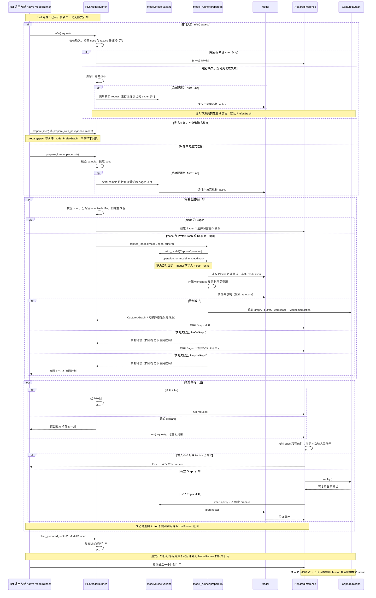
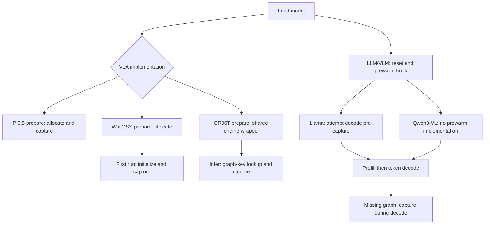
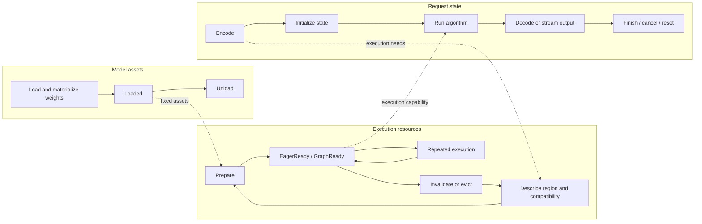
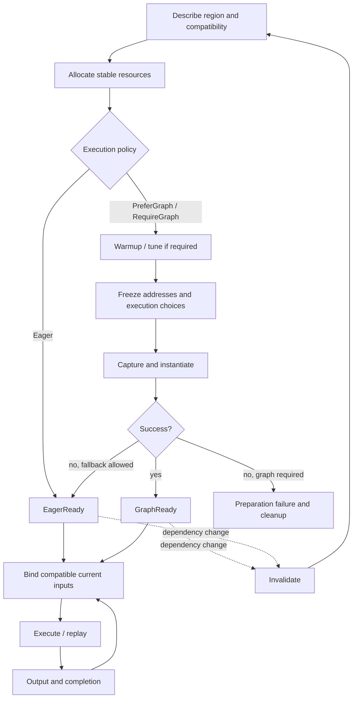
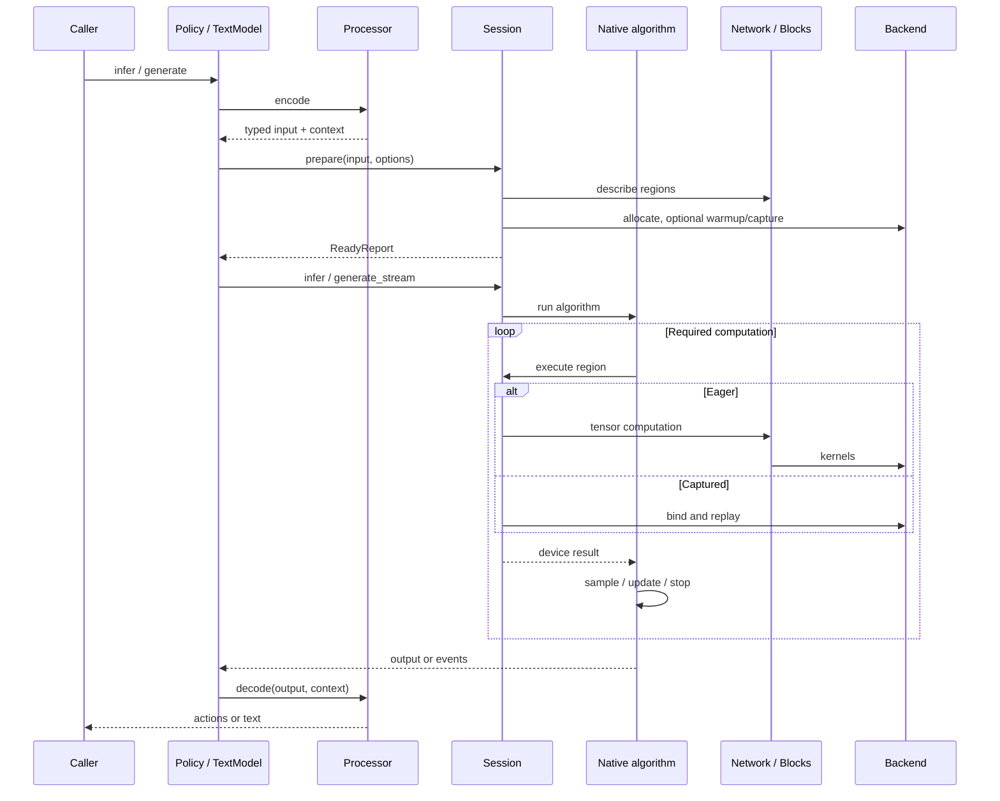

# PI0.5 preparation and lifecycle contracts

The first section describes the implemented PI0.5 API on this branch. Use
[Model Lifecycle and Contracts](../model-lifecycle.md) for shared lifecycle
responsibilities and [Model Layer Architecture](../model-layer-architecture.md#current-coverage-and-port-decisions)
for family support. Historical cross-family observations and target interfaces
are retained at the end; they are not additional APIs to implement by name.

## Implemented PI0.5 preparation contract

These Rust interfaces are implemented on the refactor branch. Hardware evidence
and model coverage are recorded in the [migration tracker](migration.md).
PI0.5 supports them for all three ModelVariantChoice choices. Other VLA families
retain their existing prepare path and return an unsupported error for the new
policy methods; their default status is RuntimeManaged, never a fabricated Ready.
Python processing and action decoding are unchanged; PI0.5 loading uses the new
model_variant field. See the architecture document for breaking entry changes.

### ModelRunner 生命周期：准备、执行、失效与释放

ModelRunner 是长期对象；`model_runner/prepare.rs` 是被调用的模块，没有一个长期运行的 Prepare
对象。ModelRunner 决定执行策略并分配请求输入/noise buffer；prepare 模块负责 graph
workspace、固定 modulation、预热、录制和 CapturedGraph 封装。PreparedInference
是准备结果，既可以使用 Eager，也可以使用 Graph。
时序图从上向下阅读：实线箭头是调用/操作，虚线箭头是返回；
alt 是互斥分支，opt 是满足条件才执行。它们与类图的持有箭头含义不同。



### 参数、返回值和调优开关

`ExecutionPolicy` 是执行选项，与 Python `Pi05Policy` 不是同一个概念。
`spec` 当前只有 token_count 和 image_layout（None 表示 patches）；视图数、
动作长度等固定尺寸来自模型 config。`sample` 是包含实际 RGB/patches、token IDs
和初始噪声或 RNG key 的 VlaRequest，不是原始 prompt 文本。

| 接口 | 行为与场景 |
| --- | --- |
| prepare(spec) | 等价于 prepare_with_policy(spec, PreferGraph)；已知规格，使用默认策略 |
| prepare_with_policy(spec, mode) | 不做样本调优；已有 tactics 或使用默认选择，需要明确控制执行方式 |
| prepare_for(sample, mode) | 从样本提取 spec；仅后端加载时开启 autotune 才先进行允许调优的样本执行 |
| ModelRunner.infer(request) | 维护最近一个隐式计划；缓存有效则跳过准备，否则按需样本调优再以 PreferGraph 建计划 |
| ModelVariant.infer(inputs) | 只转发到对应 Model，不检查计划缓存，也不自动 prepare |

三个显式 prepare 均返回 `Result<Box<dyn PreparedInference>>`，创建独立计划，
不查询或填入 ModelRunner.infer 的隐式缓存。`autotune=true` 在加载时选择后端 AutoTune
模式；调优选择算子 tactics，不训练、不改权重，已有条目可以复用。它与 Eager/Graph
是独立选项。prepare_with_policy 的预热/录制以及计划 run 均禁止 autotune。

| ExecutionPolicy | 准备结果 |
| --- | --- |
| Eager | 不尝试录图；分配输入/noise/RGB 等资源并创建 Eager 计划；run 仍可能分配临时内存 |
| PreferGraph | 成功为 Graph；录制失败可返回 Eager 和 fallback_reason；输入/分配错误仍可能报错 |
| RequireGraph | 必须返回 Graph 计划；录制失败返回 Err，不回退 |

`strategy` 是 `Eager(EagerInputs)` 或 `Graph(CapturedGraph)`；Graph 分支就是 enum
变体，不是额外阶段。`status()` 返回 Ready(Eager/Graph) 或 Invalidated，不是准备
进度条。tactics store 身份或 generation 变化会使计划失效；显式 run 报错，由调用方
重新准备，便利 ModelRunner.infer 则自动替换失效缓存。

所谓 RNG buffer 更准确地说是**初始噪声 buffer**：prepare 分配固定地址并绑定生成器，
每次 run 根据 seed/sequence/draw 生成噪声，或复制用户提供的噪声。复用地址不代表
复用噪声值。样本调优使用的图像与 token 也不会固定到后续计划中。

`model_runner/prepare.rs` 的内部 capture 共用一条录制机制；公开 capture_patches/capture_rgb
仅按输入形式提供两个低层入口，不是三个录制阶段。普通 Python Pi05Policy.infer
经过绑定 ModelRunner.infer_rgb 调用 Pi05ModelRunner.infer，默认 PreferGraph；当前 Python Policy
没有直接暴露上述显式 prepare / ExecutionPolicy 选项。

```rust
// Callable interfaces, abbreviated result/error types only.
LoadedModel::prepare_with_policy(&InferenceSpec, ExecutionPolicy)
    -> Result<Box<dyn PreparedInference>>;
LoadedModel::prepare_for(&VlaRequest, ExecutionPolicy)
    -> Result<Box<dyn PreparedInference>>;
PreparedInference::status() -> PreparationStatus;
PreparedInference::run(&VlaRequest) -> Result<Action>;
LoadedModel::clear_prepared() -> Result<()>;

// Example: strict captured inference, explicit re-preparation on invalidation.
let plan = model.prepare_for(&sample, ExecutionPolicy::RequireGraph)?;
match plan.status() {
    PreparationStatus::Ready { mode: ExecutionMode::Graph, .. } => {
        let action = plan.run(&request)?;
        // Consume/copy action before another run writes this graph's output.
    }
    PreparationStatus::Invalidated => { /* prepare a replacement */ }
    _ => { /* unsupported or unexpected state for this policy */ }
}
```

| Interface / event | Actual guarantee |
| --- | --- |
| Eager preparation | No graph attempt; native eager allocations may still occur during run |
| PreferGraph | Capture attempted during preparation; failure reason retained in Ready(Eager) |
| RequireGraph | Capture error propagates; no eager plan returned |
| Ready | Fixed spec and current tuning store identity/generation; not readiness for all shapes or models |
| Tactic store replacement or generation changes | Graph and eager plans report Invalidated; run rejects them |
| Invalid input | Run returns an error without automatic plan eviction or recapture |
| execution_mode on ModelRunner | Reports the implicit cache only; use plan.status() for explicitly owned plans |
| clear_prepared | Synchronizes and evicts the runner's implicit cache; caller-owned plans and output allocation views remain alive |
| Request reset | PI0.5 binds every input and full RNG key per call; no implicit episode counter to reset |
| Output | Device tensor; captured result aliases reusable output storage until next run; Tensor clone is not a value snapshot |
| Concurrency | Fixed-buffer plans run serially; thread-local tuning suppression does not add thread safety |

The pilot does not promise allocation-free eager execution or cancellation, and
resource measurements apply only to the tested profiles. Processor
encode/decode context stays in the existing Python Policy helpers. Broader
lifecycle guarantees above remain targets until separately implemented and tested.


### Stage 2 resource preparation and invalidation details

The complete sequence above replaces the previous diagram that merged Model
and prepare into one participant. CUDA backend capture uses a scoped cleanup
mechanism: errors/unwind end and discard capture, and known capture errors are
cleared before later execution. ModelRunner calls model_runner/prepare, which uses the internal ModelOperation seam
to run the selected Model. Model does not depend on model_runner or a
long-lived preparation object.


Graph handles are in-process objects, not serialized cache files. The captured
resource owner retains Model and therefore every referenced fixed weight,
plus workspace, modulation tensors, input buffers and reusable output. Request data
is rebound before replay. Dropping the ModelRunner does not invalidate a separately
owned prepared plan. Retained plans may therefore keep considerable GPU memory
alive; explicit cache eviction releases only the ModelRunner's implicit plan.
A captured output Tensor also owns a view of the arena allocation. Keeping that
Tensor can retain the entire arena after the plan is dropped. Consume/copy the
value and release old output handles as well as plans when measuring memory
reclamation. Cloning the Tensor preserves ownership and aliasing; it does not
create a compact independent output allocation.

A plan records both the tuning store `Arc` identity and its generation. Replacing
the store with another generation-zero store invalidates old plans just as a
record update does. Compatible prepared execution suppresses tuning; it never
refreshes that identity or quietly captures a replacement. Callers prepare a new
plan after invalidation.

The CUDA scope discards failed captures without instantiating them. Ending an
invalidated capture releases the stream, but CUDA's last-error slot still needs
handling before a later kernel launch check. Cleanup consumes only the known
capture Unsupported/Invalidated errors (900/901); unrelated device errors remain
visible. No device reset is attempted. See NVIDIA's [stream capture API](https://docs.nvidia.com/cuda/cuda-runtime-api/group__CUDART__STREAM.html)
and [last-error semantics](https://docs.nvidia.com/cuda/cuda-runtime-api/group__CUDART__ERROR.html).

## Historical cross-family specification

The following observations/proposals were written against upstream/main
`7baa69b`. Names such as Session, Network, ReadyReport and create_session are
historical design vocabulary, not the current PI0.5 interface. The implemented
signatures above and current module responsibility table take precedence.

### Current lifecycle differences at upstream/main 7baa69b

| Family | Preparation and capture | State / output observations |
| --- | --- | --- |
| PI0.5 | Explicit prepare allocates and attempts capture, with eager fallback; automatic infer may tune on a real request first | Prepared plan owns resources; tuning-generation checks; device Action |
| WallOSS | prepare allocates; first run initializes and captures; explicit no-graph path; capture errors otherwise propagate | Private input/noise-mode constraints; device Action |
| GR00T | prepare returns a wrapper sharing engine; infer checks private graph key and captures on demand, with eager fallback | Engine owns graph; explicit noise required; Action already on CPU |
| Llama | Shared generation resets state, attempts decode prewarm, then prefill/decode | Actual decode implementation uses one capacity-bound graph; lazy capture still possible |
| Qwen3-VL | Shared generation; prewarm hook is default no-op; decode captures on new KV-length bucket | Image processing in prefill; KV and rope delta reset; power-of-two decode buckets |

VLA public InferenceSpec currently contains only token_count and image_layout;
private model constraints are richer. Generic Action device-residency comments
are not matched by GR00T's current host-return behavior. These are migration
inputs, not claims that numerical results are incorrect.



### Three lifetimes



KV storage is reusable; its valid content/length belongs to a generation.
Latent storage is reusable; latent values belong to an inference. Request reset
is not plan eviction or model unload. Conversation/episode state, when needed,
has an explicit owner and reset scope; it is not inferred from a socket closing.
Sessions are serial by default, not implicitly thread-safe or concurrent.

### Preparation and CUDA Graph contract

Prepare establishes readiness for an execution region and compatible input range,
not one boolean for an entire model. Load normally performs checkpoint parsing,
weight packing/quantization and upload. Processor encodes user input. Prepare
ensures execution resources and choices are ready; already available work is reused.
Calibration profiles are loaded/validated assets, not collected on every prepare.



Required invariants:

- Ready means the selected region will not secretly allocate new capacity, tune
  or capture inside execute. A convenient infer/generate may call ensure_prepared.
- Unknown decode ranges may cause an explicit preparation transition mid-request;
  predictable ranges may be prewarmed. Report preparation separately from execution.
- A whole VLA loop, a decode step, or a smaller supported region may be captured.
  Stage uniformity does not require identical graph topology or graph count.
- Warmup/tuning uses isolated or safely restored state. It must not consume the
  real request RNG sequence, advance KV state or denoising steps. Extending a plan
  during generation must preserve the active request, not reset it.
- Plan validity covers actual bound shape/layout, capacity, model/weight identity,
  device, precision and tuning dependencies. Ordinary data updates should use
  stable buffers, not unnecessarily enter the cache key.
- PreferGraph fallback is observable with its reason; RequireGraph fails on
  capture failure. Failed capture cleans up handles/resources and declares reuse.
- Invalid requests do not automatically destroy an otherwise healthy plan.

Graph storage is an in-process executable handle, not checkpoint serialization.
Current backend wrappers retain graph/exec handles and destroy them on drop.
The owning plan must keep every referenced buffer, workspace, weight and device
context alive. Graph handles alone do not own all user memory they reference.

```rust
// Pseudocode: ownership can be shared rather than duplicated per plan.
struct PreparedPlan {
    compatibility: PlanKey,
    mode: EagerOrGraph,
    inputs_outputs: StableBuffers,
    workspace: Workspace,
    resources: RetainedDependencies, // model/state storage/context references
}
struct Session {
    model: SharedModel,
    plans: BoundedPlanCache,
    state_storage: StateStorage,
    request_state: RequestState,
}
```

Session decides budgets and lifetime; backend supplies allocator/graph mechanisms.
Reuse existing GraphWorkspace initially rather than introducing a second allocator.
Current GR00T and WallOSS reservations are 4 GiB and 12 GiB respectively, not
intrinsic graph requirements. Report reserved, cumulative allocated and peak live
bytes separately. Replacement must respect total budget and wait for safe resource
release. Writable fixed-buffer plans cannot be concurrently reused without isolation.

### Interfaces and module interaction

| Role | Conceptual interface | Contract |
| --- | --- | --- |
| Model | load(options); create_session(limits, policy) | Fixed assets and declared capabilities; no implicit request state sharing |
| Processor | encode(raw) -> typed input + output context | Model-specific semantics, validated layout/units and per-request context |
| Network | describe(region, input, options); compute(region, state_view, ctx) | Execution needs and tensor computation; no plan eviction or prompt interpretation |
| Session | prepare(input, options) -> ReadyReport | Per-region mode, preparation work and fallback reason |
| Session | infer / generate_stream | Native algorithm execution using compatible resources |
| Driver | generate / infer_action | Sampling, EOS and algorithm iteration/update rules |
| Processor | decode(output, context) | Final actions or incremental text; preserve request association |
| Session | reset_request; clear_plans; close/drop | Separate semantic reset, cache eviction and resource release |

These roles do not mandate one universal trait or optional-field-heavy input bag.
VLA action inference and LLM/VLM generation retain distinct public capabilities.
Initial noise or RNG is a run option, not an environment observation field.



```rust
fn generate(session, prompt, options, emit) {
    session.reset_request();
    sampler.begin(options);
    logits = session.execute(Prefill, prompt);
    for index in 0..options.max_new_tokens {
        token = sampler.sample(logits);
        emit(token);
        if is_eos(token) || index + 1 == options.max_new_tokens { break; }
        session.ensure_decode_ready(next_position); // explicit if needed
        logits = session.execute(Decode, token);
    }
}
// VLM changes prefill (vision + feature merge), not the per-token generation loop.
fn flow_inference(input, options) {
    condition = network.encode_condition(input);
    latent = initialize_latent(options.noise);
    for time in schedule {
        velocity = network.predict_velocity(condition, latent, time);
        latent = solver.update(latent, velocity, time);
    }
    return latent;
}
// A fixed flow body may be captured as one region; no host step loop is required.
```

ModelOutput specifies device, completion ordering and ownership. Device results
must remain available without an unconditional host transfer. A borrowed output
must state when the next run overwrites it; the facade consumes or copies before
reuse. Cross-stream or host consumption observes completion. DecodeContext stays
outside Network; LLM incremental detokenization may retain request-local state.

### Verification contract

Every migrated model/precision declares accepted inputs, exact-noise/seed behavior,
output tolerances and supported hardware. Verify public raw-input paths, eager vs
graph parity, state reset, graph reuse/invalidation, fallback/cleanup, cancellation
and output lifetime as applicable. Measure cold preparation, steady-state latency,
LLM TTFT/TPOT, and device memory separately. A documentation or CPU check does not
qualify native GPU execution; unsupported or untested matrix cells remain explicit.


### Deferred GEMM autotuning

Preparation and prepared runs suppress autotuning, but may cache default or
bucket GEMM choices. Those plans retain an `autotune_pending` flag. A later
real-input `prepare_for` with an AutoTune backend resolves the deferred work
before reusing the plan. Exact choices and already attempted tuning failures
remain cached within the same tuning generation. Publishing new exact choices
invalidates previously prepared inference plans through the existing generation
check; callers must use the newly returned plan.

The native regression `native_prepare_for_tunes_after_suppressed_preparation`
checks both Eager and RequireGraph with a real checkpoint. It verifies deferred
tuning, stale-plan rejection and reuse without repeated tuning.
